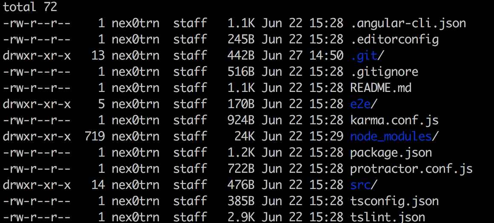

# Setup environment:
### Prerequisites: node 6.9.x and npm 3.x.x

###Install Angular CLI 
* it will setup Angular2 , 
```$ npm install -g @angular/cli```

### Create new project:
* create folder structure,  and download needed packages (for testing etc)

```$ ng new embark-ui```



### Serve the application

```
cd embark-ui
ng serve --open
```
`--open` will automatically open the browser 

`npm start` runs the TypeScript command in watch mode, recompiles automatically and refreshes the browser when change is detected. 
